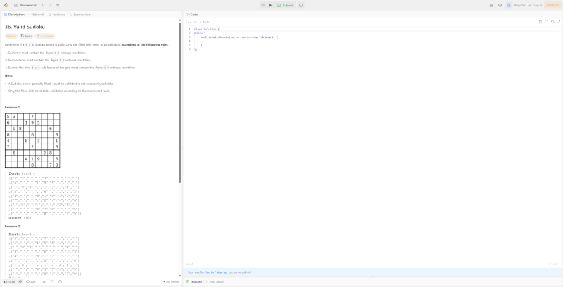

[](https://conventionalcommits.org)
[](https://renovatebot.com/)
[](https://sonarcloud.io/summary/new_code?id=coding-challenge-souffleur)
[](https://github.com/TheSouffleuringHatter/coding-challenge-souffleur/actions/workflows/test.yml)

# Coding Challenge Souffleur

A stealthy AI-powered coding assistant that whispers solutions directly into your workflow. This
Windows desktop application creates a transparent overlay that analyzes coding problems and provides
intelligent solutions without disrupting your screen sharing or recording sessions.

| What Screenshare sees                                      | What you see                                      |
|------------------------------------------------------------|---------------------------------------------------|
|  |  |

[](https://github.com/SchulteDev/ConversationalAI4J)

This project is in an early alpha stage. Features are functional but may contain bugs and APIs may
change.

[](https://github.com/SchulteDev/ConversationalAI4J)

## ✨ The Souffleur's Magic Tricks

**🫥 Invisible to Screen Sharing**: The overlay automatically excludes itself from screen captures
and recordings — perfect for interviews, presentations, or streaming where you want AI assistance
without anyone knowing.

**👻 Ghost Mode**: Transparent overlay that appears over any application without interfering with the
underlying interface.

**🎯 Keyboard Event Absorption**: Uses native Windows keyboard hooks to "suck up" all keyboard events
within the application, preventing keyloggers or screen readers from detecting your interactions
with the AI.

**📑 Multi-Solution Analysis**: Provides up to 3 different solution approaches for each coding
problem with descriptive tabs like "Hash Map Approach", "Two Pointers", "Sliding Window" —
giving you multiple perspectives and learning opportunities.

## 🚀 Quick Start

### Prerequisites

- Windows 10/11
- Java 21+
- Anthropic API key with Claude access

### Setup

1. **Get your API key**: Sign up at [Anthropic](https://console.anthropic.com/)
   and create an API key
2. **Set your API key** as an environment variable:
   ```cmd
   set ANTHROPIC_API_KEY=your-api-key-here
   ```
3. **Download the latest release**
   ```bash
   git clone https://github.com/yourusername/coding-challenge-souffleur.git
   cd coding-challenge-souffleur
   ```
4. **Run the application**:

- Gradle run in Command Prompt: `gradlew.bat run`
- Silent run in PowerShell: `.\RunSilently.vbs`

## 🎮 Usage

The Souffleur operates entirely through keyboard shortcuts.

Souffleur activation modifier is `Control on the righten side`.

| Key     | Action        | Description                          |
|---------|---------------|--------------------------------------|
| `R`     | 📸 Screenshot | Capture and preview current screen   |
| `T`     | 🔍 Analyze    | Send screenshot to AI for analysis   |
| `↑↓←→`  | Move          | Reposition the overlay window        |
| `1/2/3` | 📑 Switch Tab | Switch between solution tabs         |
| `4/5`   | ⬆️⬇️ Scroll   | Navigate through current tab content |
| `W`     | 🚫 Hide/Show  | Toggle overlay visibility            |
| `Q`     | 🚫 Exit       | Exit Souffleur                       |

### Typical Workflow

1. Position the overlay over your coding problem
2. Press `R` to take a screenshot
3. Press `T` to get AI analysis with multiple solution approaches
4. Use `1/2/3` to switch between different solution tabs
5. Use `4/5` to scroll through the current solution
6. Press `W` to hide/show
7. Press `Q` to exit when done

## 🛠 Configuration

Create `.env` or edit `src/main/resources/META-INF/microprofile-config.properties`:
 
```properties
# AI Model Configuration
anthropic.model=claude-sonnet-4-0
anthropic.api.key=your-api-key-here
# Screenshot Configuration  
save.screenshot.to.file=false
# Application Behavior Configuration
app.exit.platform.on.close=true
app.keyboard.filter.injected.keys=true  
app.stage.creation.async=true
app.keyboard.modifier.keys=VK_RCONTROL
```

### Configuration Properties

| Property                            | Description                                                 | Production Default | Test Default          |
|-------------------------------------|-------------------------------------------------------------|--------------------|-----------------------|
| `app.exit.platform.on.close`        | Whether to call `Platform.exit()` when closing              | `true`             | `false`               |
| `app.keyboard.filter.injected.keys` | Filter out injected keystrokes                              | `true`             | `false`               |
| `app.stage.creation.async`          | Create stage asynchronously (true) or synchronously (false) | `true`             | `false`               |
| `app.keyboard.modifier.keys`        | Modifier keys for shortcuts (comma-separated Win32VK)       | `VK_RCONTROL`      | `VK_LSHIFT,VK_RSHIFT` |

The test environment automatically overrides these settings in
`src/test/resources/META-INF/microprofile-config.properties` to ensure proper test execution.

#### Modifier Key Examples

The `app.keyboard.modifier.keys` property accepts comma-separated Win32VK constants:

- **Single key**: `VK_RCONTROL` (right Ctrl only)
- **Multiple keys**: `VK_LSHIFT,VK_RSHIFT` (any shift key)
- **Mixed modifiers**: `VK_LCONTROL,VK_RCONTROL,VK_MENU` (any Ctrl or Alt)

Common Win32VK constants:

- `VK_LCONTROL` / `VK_RCONTROL` - Left/Right Ctrl
- `VK_LSHIFT` / `VK_RSHIFT` - Left/Right Shift
- `VK_LMENU` / `VK_RMENU` - Left/Right Alt
- `VK_LWIN` / `VK_RWIN` - Left/Right Windows key

## 📋 System Requirements

- **OS**: Windows 10 or Windows 11
- **Java**: Version 21 or higher
- **Network**: Internet connection for AI analysis

## ❓ FAQ

### How does screen hiding work?

The Souffleur calls Windows API `SetWindowDisplayAffinity` with `WDA_EXCLUDEFROMCAPTURE` flag on
the application window.

This tells Windows to exclude the window from any screen capture, recording, or
sharing — including OBS, Teams, Zoom, and Windows built-in screenshot tools.

Additionally, the Souffleur window never gets activated and is transparent, event to mouse clicks.

You can **test** this functionality yourself locally by running Souffleur,
then running a screen capture tool like
[Snipping Tool](https://www.microsoft.com/de-de/windows/tips/snipping-tool).

Windows details:

- https://learn.microsoft.com/en-us/windows/win32/api/winuser/nf-winuser-setwindowdisplayaffinity

Implemented in:
[WindowFromScreenCaptureHider.java](src/main/java/dev/coding_challenge_souffleur/view/WindowFromScreenCaptureHider.java)

### How does keyboard event absorption work?

Uses low-level Windows keyboard hooks (`SetWindowsHookEx` with `WH_KEYBOARD_LL`) to intercept
system-wide keyboard events.

When a registered key combination is detected, the application
processes the action and marks the event as "handled," preventing it from reaching other
applications or being logged by external monitoring tools.

BUT the keyboard event absorption is not applied in case of injected keystrokes,
ensuring appropriate tools work as expected.

Windows details:

- https://learn.microsoft.com/en-us/windows/win32/winmsg/lowlevelkeyboardproc
- https://learn.microsoft.com/en-us/windows/win32/winmsg/about-hooks#wh_keyboard_ll

Implemented in:
[KeyboardEventProcessor.java](src/main/java/windowskeyboardhook/KeyboardEventProcessor.java)

## 🔧 Development

### Building and Testing

- **Build**: `./gradlew build` or `gradlew.bat build`
- **Run tests**: `./gradlew test`
- **Run single test**: `./gradlew test --tests "ClassName.methodName"`
- **Generate coverage**: `./gradlew jacocoTestReport`

### Architecture Overview

This is a Windows-only JavaFX application with:

- **CDI (Weld)** dependency injection
- **JNA** for Windows API integration (`SetWindowDisplayAffinity`, keyboard hooks)
- **Anthropic Java SDK** for Claude API
- **TestFX + Mockito** for testing

Main entry: `ApplicationLauncher.java` → `JavaFxApplication.java`

Key packages: `model/` (services), `view/` (JavaFX), `windowskeyboardhook/` (Windows integration)

## 💡 Inspired by...

1. Interview with **Chungin Lee**, author of [Interview Coder](https://www.interviewcoder.co):
   > Someone could probably build a working prototype version of this that works in less than 1,000
   > lines of code.
   >
   > https://gizmodo.com/a-student-used-ai-to-beat-amazons-brutal-technical-interview-he-got-an-offer-and-someone-tattled-to-his-university-2000571562

   Yeah, he was right (976 executables lines of code).

2. > A simple key stroke capturing react app can identify when users are pressing unnecessary keys
   > during any rounds.
   >
   > https://www.reddit.com/r/brdev/comments/1jlt9x5/comment/modns5c

   Ha, wrong!
